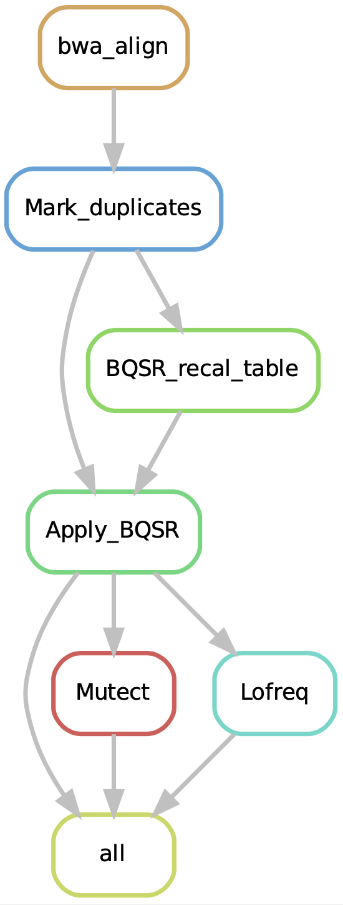

This is a pipeline to produce variant calls using Mutect2 and Lofreq from WGS data. Follow the following steps to use this pipeline 

Make a directory "data". Within that, make a sub-directory "samples". Save fastq files in data/samples/ folder as "XXX_plus_R1.fastq.gz" and "XXX_minus_R1.fastq.gz". XXX could be anything. Plus is "edited"/tumor. Minus is control. Save genome files in /data folder
* Step 1: Create the environment: conda env create --name **env_name** --file environment.yaml. and then activate.
* Step 2: Adjust samples.tsv file
* Step 3: Adjust config file
* Step 4: Fix the path in rule all block.
* Step 5: Cluster Run: snakemake --cluster sbatch --latency-wait 30  -j 6 \
* Step 6: Create dag: snakemake --dag | dot -Tpdf > dag.pdf
* Step 7: Create rulegraph: snakemake --rulegraph | dot -Tpdf > rulegraph.pdf

